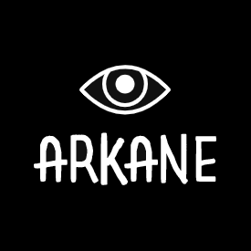

# Arkane

  

Arkane is a game engine, using Vulkan as render API

I will work on this engine in order to let it be a proper engine and I'm writing this out of my experience of my previous engine [Ion](https://github.com/KabalMcBlade/Ion)

## Status

**Work in progress**

## NOTE ABOUT DEPENDENCIES
The dependencies which I have imported as sub module (such glm for instance) if any Warning in compile time is raised I leave as is, because I do not want to request integration.
The dependencies which I have manually imported (such VMem) if any Warning in compile time is raised I suppuress as much as I can or fixed, moreover for such imported dependencies I cleaned up the folder from unused files. Of course keeping the original copyright notice and everything else.

## LICENSE ARKANE ENGINE GPL-3

- Code nested licenses:
	- **VMem** is under GPL-3.0 License
	- **glm** is under MIT License
	- **VulkanMemoryAllocator** is under MIT License
	- **json.hpp** is under MIT License
	- **stb_image.h** is under MIT License OR Public Domain
	- **stb_image_write.h** is under MIT License OR Public Domain
	- **tiny_gltf.h** is under MIT License
	- **tiny_ktx.h** is under MIT License

## LICENSE DEMO GPL-3

- Code nested licenses:
	- **glfw** is under zlib/libpng License

# Build Status

|  Platform  | Architecture  | Build Status |
|:----------:|:------:|:------------:|
| Windows (Visual Studio 2019) | x86 |  |
| Windows (Visual Studio 2019) | x64 |  |
